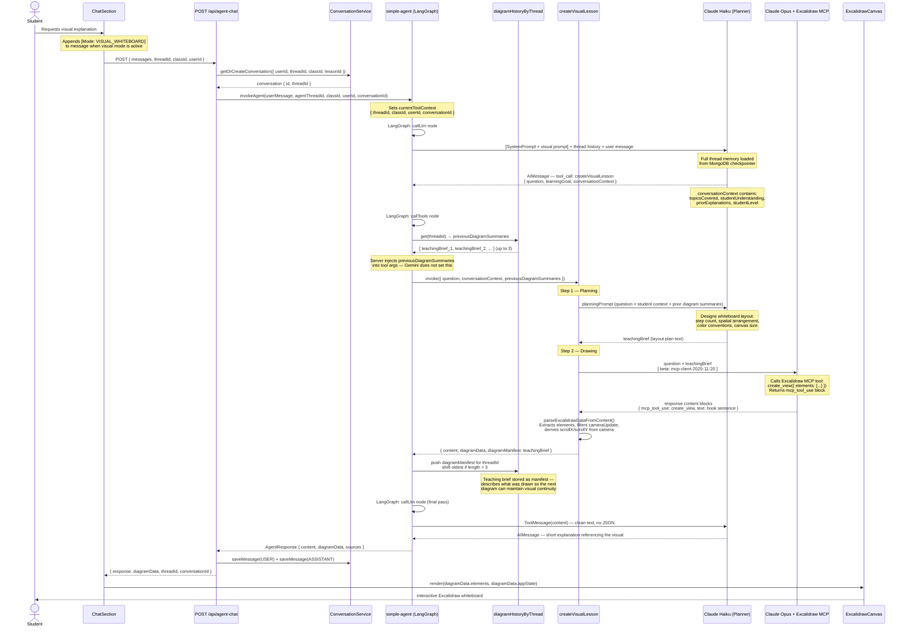
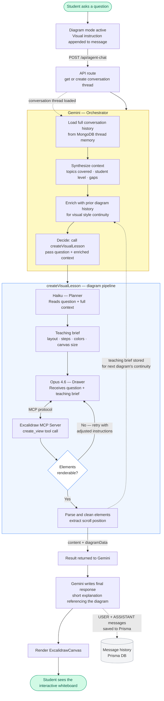

# Visual Diagram Feature — UML Sequence Diagram

## Full flow: from student request to Excalidraw canvas

```mermaid
sequenceDiagram
    actor Student
    participant UI as ChatSection
    participant API as POST /api/agent-chat
    participant CONV as ConversationService
    participant SA as simple-agent (LangGraph)
    participant HIST as diagramHistoryByThread
    participant VL as createVisualLesson
    participant HAIKU as Claude Haiku (Planner)
    participant OPUS as Claude Opus + Excalidraw MCP
    participant CANVAS as ExcalidrawCanvas

    Student->>UI: Requests visual explanation
    Note over UI: Appends [Mode: VISUAL_WHITEBOARD]<br/>to message when visual mode is active

    UI->>API: POST { messages, threadId, classId, userId }
    API->>CONV: getOrCreateConversation({ userId, threadId, classId, lessonId })
    CONV-->>API: conversation { id, threadId }

    API->>SA: invokeAgent(userMessage, agentThreadId, classId, userId, conversationId)
    Note over SA: Sets currentToolContext<br/>{ threadId, classId, userId, conversationId }

    SA->>SA: LangGraph: callLlm node
    SA->>HAIKU: [SystemPrompt + visual prompt] + thread history + user message
    Note over HAIKU: Full thread memory loaded<br/>from MongoDB checkpointer

    HAIKU-->>SA: AIMessage — tool_call: createVisualLesson<br/>{ question, learningGoal, conversationContext }
    Note over HAIKU: conversationContext contains:<br/>topicsCovered, studentUnderstanding,<br/>priorExplanations, studentLevel

    SA->>SA: LangGraph: callTools node
    SA->>HIST: get(threadId) → previousDiagramSummaries
    HIST-->>SA: [ teachingBrief_1, teachingBrief_2, ... ] (up to 3)
    Note over SA: Server injects previousDiagramSummaries<br/>into tool args — Gemini does not set this

    SA->>VL: invoke({ question, conversationContext, previousDiagramSummaries })

    Note over VL: Step 1 — Planning
    VL->>HAIKU: planningPrompt (question + student context + prior diagram summaries)
    Note over HAIKU: Designs whiteboard layout:<br/>step count, spatial arrangement,<br/>color conventions, canvas size
    HAIKU-->>VL: teachingBrief (layout plan text)

    Note over VL: Step 2 — Drawing
    VL->>OPUS: question + teachingBrief<br/>[ beta: mcp-client-2025-11-20 ]
    Note over OPUS: Calls Excalidraw MCP tool:<br/>create_view({ elements: [...] })<br/>Returns mcp_tool_use block
    OPUS-->>VL: response content blocks<br/>{ mcp_tool_use: create_view, text: hook sentence }

    VL->>VL: parseExcalidrawDataFromContent()<br/>Extracts elements, filters cameraUpdate,<br/>derives scrollX/scrollY from camera
    VL-->>SA: { content, diagramData, diagramManifest: teachingBrief }

    SA->>HIST: push diagramManifest for threadId<br/>shift oldest if length > 3
    Note over HIST: Teaching brief stored as manifest —<br/>describes what was drawn so the next<br/>diagram can maintain visual continuity

    SA->>SA: LangGraph: callLlm node (final pass)
    SA->>HAIKU: ToolMessage(content) — clean text, no JSON
    HAIKU-->>SA: AIMessage — short explanation referencing the visual

    SA-->>API: AgentResponse { content, diagramData, sources }
    API->>CONV: saveMessage(USER) + saveMessage(ASSISTANT)
    API-->>UI: { response, diagramData, threadId, conversationId }

    UI->>CANVAS: render(diagramData.elements, diagramData.appState)
    CANVAS-->>Student: Interactive Excalidraw whiteboard
```

---

## Full pipeline: from user query to Excalidraw canvas

```mermaid
flowchart TD
    START([Student asks a question])
    START --> TRIGGER[Diagram mode active\nVisual instruction appended to message]
    TRIGGER -->|POST /api/agent-chat| API[API route\nget or create conversation thread]

    API --> GEMINI

    subgraph GEMINI [Gemini — Orchestrator]
        G1[Load full conversation history\nfrom MongoDB thread memory]
        G2[Synthesize context\ntopics covered · student level · gaps]
        G3[Enrich with prior diagram history\nfor visual style continuity]
        G4[Decide: call createVisualLesson\npass question + enriched context]
        G1 --> G2 --> G3 --> G4
    end

    G4 --> TOOL

    subgraph TOOL [createVisualLesson — diagram pipeline]
        P1[Haiku — Planner\nReads question + full context]
        P2[Teaching brief\nlayout · steps · colors · canvas size]
        P1 --> P2

        P2 --> D1[Opus 4.6 — Drawer\nReceives question + teaching brief]
        D1 <-->|MCP protocol| D2[Excalidraw MCP Server\ncreate_view tool call]
        D2 --> D3{Elements\nrenderable?}
        D3 -->|No — retry with\nadjusted instructions| D1
        D3 -->|Yes| D4[Parse and clean elements\nextract scroll position]
    end

    D4 -->|content + diagramData| BACK[Result returned to Gemini]
    BACK --> RESP[Gemini writes final response\nshort explanation referencing the diagram]

    RESP --> CANVAS[Render ExcalidrawCanvas]
    CANVAS --> END([Student sees the interactive whiteboard])

    API -. "conversation thread loaded" .-> G1
    D4 -. "teaching brief stored\nfor next diagram's continuity" .-> G3
    RESP -. "USER + ASSISTANT messages\nsaved to Prisma" .-> DB[(Message history\nPrisma DB)]

    style START fill:#d1fae5,stroke:#059669,color:#065f46
    style END fill:#d1fae5,stroke:#059669,color:#065f46
    style GEMINI fill:#fef9c3,stroke:#ca8a04
    style TOOL fill:#eff6ff,stroke:#3b82f6
    style D3 fill:#ffffff,stroke:#3b82f6
    style DB fill:#f3f4f6,stroke:#9ca3af
```
