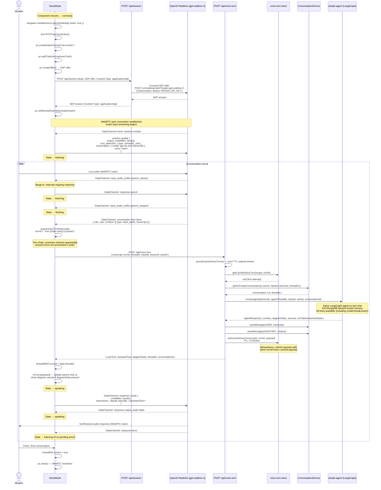
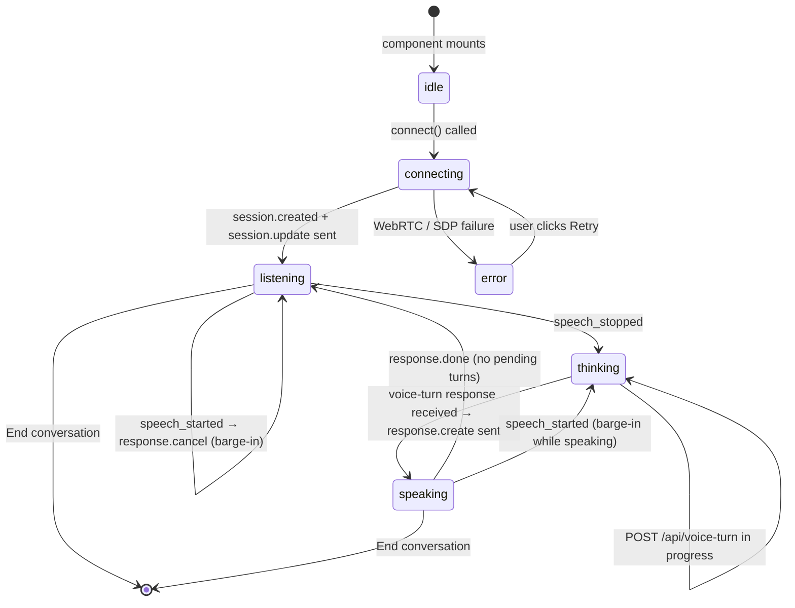
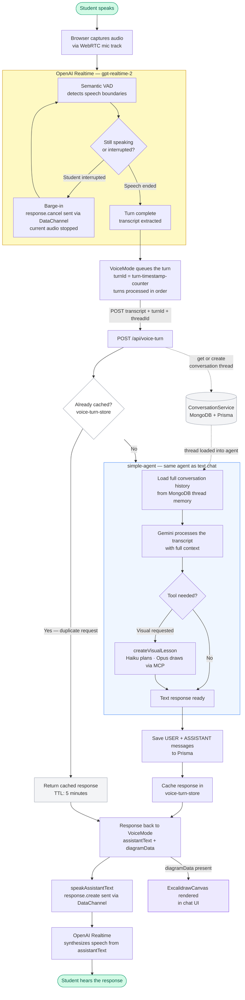

# Voice Feature — UML Sequence Diagram

## Full flow: WebRTC session → turn processing → audio response

```mermaid
sequenceDiagram
    actor Student
    participant VM as VoiceMode
    participant SESSION as POST /api/session
    participant OAI as OpenAI Realtime (gpt-realtime-2)
    participant VT as POST /api/voice-turn
    participant CACHE as voice-turn-store
    participant CONV as ConversationService
    participant SA as simple-agent (LangGraph)

    Note over VM: Component mounts → connect()

    VM->>VM: navigator.mediaDevices.getUserMedia({ audio: true })
    VM->>VM: new RTCPeerConnection()
    VM->>VM: pc.createDataChannel("oai-events")
    VM->>VM: pc.addTrack(microphoneTrack)
    VM->>VM: pc.createOffer() → SDP offer

    VM->>SESSION: POST /api/session (body: SDP offer, Content-Type: application/sdp)
    SESSION->>OAI: Forward SDP offer<br/>POST /v1/realtime/calls?model=gpt-realtime-2<br/>[ Authorization: Bearer OPENAI_API_KEY ]
    OAI-->>SESSION: SDP answer
    SESSION-->>VM: SDP answer (Content-Type: application/sdp)

    VM->>VM: pc.setRemoteDescription(sdpAnswer)
    Note over VM,OAI: WebRTC peer connection established<br/>Audio track streaming begins

    OAI-->>VM: DataChannel event: session.created
    VM->>OAI: session.update {<br/>  output_modalities: [audio],<br/>  turn_detection: { type: semantic_vad },<br/>  transcription: { model: gpt-4o-mini-transcribe },<br/>  voice: marin<br/>}
    Note over VM: State → listening

    loop Conversation turns

        Student->>OAI: Live audio (WebRTC track)
        OAI-->>VM: DataChannel: input_audio_buffer.speech_started
        Note over VM: Barge-in: interrupt ongoing response
        VM->>OAI: DataChannel: response.cancel
        Note over VM: State → listening

        OAI-->>VM: DataChannel: input_audio_buffer.speech_stopped
        Note over VM: State → thinking

        OAI-->>VM: DataChannel: conversation.item.done<br/>{ role: user, content: [{ type: input_audio, transcript }] }
        VM->>VM: queueVoiceTurn(transcript)<br/>turnId = "turn-{Date.now()}-{counter}"
        Note over VM: Turn chain: promises chained sequentially<br/>ensures turns are processed in order

        VM->>VT: POST /api/voice-turn<br/>{ transcript, turnId, threadId, classId, lessonId, userId }

        VT->>VT: pruneExpiredVoiceTurns() — evict TTL-expired entries
        VT->>CACHE: getCachedVoiceTurn(scope, turnId)
        CACHE-->>VT: null (first attempt)

        VT->>CONV: getOrCreateConversation({ userId, classId, lessonId, threadId })
        CONV-->>VT: conversation { id, threadId }

        VT->>SA: invokeAgent(transcript, agentThreadId, classId, userId, conversationId)
        Note over SA: Same LangGraph agent as text chat<br/>Full MongoDB-backed thread memory<br/>All tools available (including createVisualLesson)
        SA-->>VT: AgentResponse { content, diagramData, sources, inChatAssessmentData }

        VT->>CONV: saveMessage(USER, transcript)
        VT->>CONV: saveMessage(ASSISTANT, content)
        VT->>CACHE: setCachedVoiceTurn(scope, turnId, payload)<br/>TTL: 5 minutes
        Note over CACHE: Idempotency: retried requests with<br/>same turnId return cached payload

        VT-->>VM: { userText, assistantText, diagramData, threadId, conversationId }

        VM->>VM: threadIdRef.current = data.threadId
        VM->>VM: onTurn(payload) — update parent chat UI<br/>show diagram canvas if diagramData present
        Note over VM: State → speaking
        VM->>OAI: DataChannel: response.create {<br/>  modalities: [audio],<br/>  instructions: "Speak naturally: <assistantText>"<br/>}

        OAI-->>VM: DataChannel: response.output_audio.delta
        Note over VM: State → speaking
        OAI-->>Student: Synthesized audio response (WebRTC track)

        OAI-->>VM: DataChannel: response.done
        Note over VM: State → listening (if no pending turns)

    end

    Student->>VM: Clicks "End conversation"
    VM->>VM: closedRef.current = true
    VM->>VM: pc.close() — WebRTC teardown
```

---

## Agent state machine

```mermaid
stateDiagram-v2
    [*] --> idle : component mounts

    idle --> connecting : connect() called
    connecting --> listening : session.created + session.update sent
    connecting --> error : WebRTC / SDP failure

    listening --> listening : speech_started → response.cancel (barge-in)
    listening --> thinking : speech_stopped

    thinking --> thinking : POST /api/voice-turn in progress
    thinking --> speaking : voice-turn response received → response.create sent

    speaking --> listening : response.done (no pending turns)
    speaking --> thinking : speech_started (barge-in while speaking)

    error --> connecting : user clicks Retry

    listening --> [*] : End conversation
    speaking --> [*] : End conversation
```

---

## Full pipeline: from speech to audio response

```mermaid
flowchart TD
    START([Student speaks])
    START --> MIC[Browser captures audio\nvia WebRTC mic track]
    MIC --> OAI

    subgraph OAI [OpenAI Realtime — gpt-realtime-2]
        O1[Semantic VAD\ndetects speech boundaries]
        O2{Still speaking\nor interrupted?}
        O3[Barge-in\nresponse.cancel sent via DataChannel\ncurrent audio stopped]
        O4[Turn complete\ntranscript extracted]
        O1 --> O2
        O2 -->|Student interrupted| O3
        O3 --> O1
        O2 -->|Speech ended| O4
    end

    O4 --> QUEUE[VoiceMode queues the turn\nturnId = turn-timestamp-counter\nturns processed in order]
    QUEUE -->|POST transcript + turnId + threadId| VT[POST /api/voice-turn]

    VT --> CHK{Already cached?\nvoice-turn-store}
    CHK -->|Yes — duplicate request| HIT[Return cached response\nTTL: 5 minutes]
    CHK -->|No| AG

    subgraph AG [simple-agent — same agent as text chat]
        A1[Load full conversation history\nfrom MongoDB thread memory]
        A2[Gemini processes the transcript\nwith full context]
        A3{Tool needed?}
        A4[Text response ready]
        A5[createVisualLesson\nHaiku plans · Opus draws via MCP]
        A1 --> A2 --> A3
        A3 -->|No| A4
        A3 -->|Visual requested| A5
        A5 --> A4
    end

    A4 --> PERSIST[Save USER + ASSISTANT messages\nto Prisma]
    PERSIST --> CACHE[Cache response in\nvoice-turn-store]
    CACHE --> BACK[Response back to VoiceMode\nassistantText + diagramData]
    HIT --> BACK

    BACK --> SPEAK[speakAssistantText\nresponse.create sent via DataChannel]
    SPEAK --> SYNTH[OpenAI Realtime\nsynthesizes speech from assistantText]
    SYNTH --> END([Student hears the response])

    BACK -->|diagramData present| CANVAS[ExcalidrawCanvas rendered\nin chat UI]

    VT -. "get or create\nconversation thread" .-> DB[(ConversationService\nMongoDB + Prisma)]
    DB -. "thread loaded into agent" .-> A1

    style START fill:#d1fae5,stroke:#059669,color:#065f46
    style END fill:#d1fae5,stroke:#059669,color:#065f46
    style OAI fill:#fef9c3,stroke:#ca8a04
    style AG fill:#eff6ff,stroke:#3b82f6
    style CHK fill:#ffffff,stroke:#9ca3af
    style CANVAS fill:#ede9fe,stroke:#7c3aed
    style DB fill:#f3f4f6,stroke:#9ca3af
    style HIT fill:#f3f4f6,stroke:#9ca3af
```
