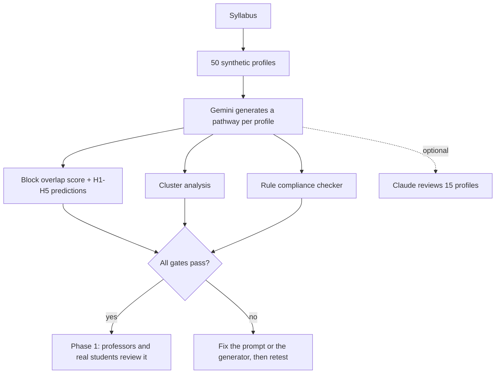

# Phase 0 Synthetic Validation Report

**Course:** AI literacy (about 10 hours of content, split into 7 blocks)
**Status:** PASS (Run 3, 50 profiles)
**Date:** July 2026

This report explains everything the team built and tested under the `study/` folder. It assumes no prior knowledge of the project. Every term gets defined the first time it shows up. You don't need to open any other file to follow along.

---

## 1. What is this report about?

SynapsEd builds learning paths for students automatically. A student fills out a short survey about their background and goals, and SynapsEd's AI reads that survey and builds a custom sequence of lessons for that student. We call this sequence a **pathway**. Each lesson inside a pathway is called a **node**.

Think of it like a music app that builds you a playlist based on your listening history. Two people with different tastes should get different playlists, not the same 20 songs with the track names changed. That is the exact question this report answers, but for lessons instead of songs.

**The question we are testing:** does SynapsEd actually build a different pathway for a different student, or does it just relabel the same generic pathway with different words?

We test this **before** running any study with real students or professors, because if the personalization is fake, there is no point putting real people through it yet. This early, cheap check is called **Phase 0**.

Phase 0 does **not** check whether the pathways are pedagogically good (whether they teach well, whether the lesson order makes sense to a human expert). That is a separate, later check called **Phase 1**, done by real professors and students. Phase 0 only checks one thing: is the personalization real and consistent, or is it random or cosmetic?

**How we tested it:** we invented 50 fake students (we call them **synthetic profiles**, explained in Section 3), ran all 50 through SynapsEd's pathway generator, and then compared the resulting pathways to each other using math and an independent AI reviewer. We used one syllabus (course outline) for this first test. Section 9 covers what we plan to test next, including a second syllabus.

### Personalization happens on two levels

This matters enough that we call it out early, because most of this report only measures one of the two.

1. **Block level:** which of the 7 topic groups (defined in Section 2) show up in a student's pathway, how many lessons come from each group, and in what order. **This is what Phase 0 measures.** It is the structural skeleton of the pathway.
2. **Node level:** inside a single topic group, which exact lesson titles and descriptions the AI picks or writes for that student. For example, two students might both get 3 lessons from the "AI Basics" group, but one student's lessons are titled with visual, beginner-friendly language and the other's use technical, research-oriented language. Phase 0 does not score this level with math. Instead, an independent AI reviewer spot-checks it (Section 5.6), and the team is actively testing additional ways to measure it (see Section 9).

Keep this distinction in mind: when this report says "personalization," it mainly means block-level personalization, unless a section says otherwise.

---

## 2. The syllabus

A **syllabus** is the master course outline: every lesson SynapsEd is allowed to draw from when building a pathway. Our syllabus was built from three existing short courses, all taught by Andrew Ng on DeepLearning.AI:

- *AI For Everyone*
- *Generative AI for Everyone*
- *AI Prompting for Everyone*

We combined these three courses into one syllabus and removed duplicate topics (if two source courses both taught "what is machine learning," we kept it once). The result covers about 10 hours of content with no coding required and no prerequisites.

We then grouped the lessons into **7 blocks**. A block is just a labeled bucket of related lessons, similar to a chapter in a textbook. Every block has a short id we use in code and in this report:

| Block | Content |
|-------|---------|
| block_01 | AI Basics (what machine learning is, key terms, how data trains a model) |
| block_02 | Generative AI Core (how tools like ChatGPT actually generate text) |
| block_03 | Prompting Basics (how to write a clear instruction for an AI) |
| block_04 | Advanced Prompting (more advanced techniques like chain-of-thought) |
| block_05a | Business and workplace track (using AI at work, strategy, adoption) |
| block_05b | Technical workflows track (building things with AI: retrieval, projects) |
| block_06 | Ethics capstone (bias, misinformation, job impact; required for everyone) |

Every lesson (node) that SynapsEd generates for a student carries a tag called `syllabusBlockId`, which just records which of the 7 blocks that lesson belongs to.

**Why we need this tag at all:** our first attempt at comparing pathways just compared lesson titles as plain text. That failed immediately. In one test, Gemini (the AI model that generates pathways, introduced in Section 4) renamed a lesson from "Introduction to AI" to "Introduction to artificial intelligence." As plain text, those two titles look almost totally different to a similarity checker, even though the lesson content and structure were identical. A title-only comparison would have told us the pathways were very different when they were not. Tagging every lesson with its block id lets us compare pathways by their actual structure (which blocks, how many lessons per block) instead of by wording that an AI can freely paraphrase.

We use these block tags to compare pathways at the block level (Section 5.1) and to check specific rules (Section 5.5). We separately check what happens inside a block, meaning which specific lesson titles get picked, using the independent AI reviewer described in Section 5.6.

---

## 3. Synthetic profiles (our 50 fake students)

### 3.1 What is a profile, and where did it come from?

A **profile** is one simulated student's answers to an onboarding survey, the kind of questionnaire a real student would fill out before starting the course. It is not a real person. We made these up so we could test the system quickly, cheaply, and repeatably, without waiting on real students.

**"Hand-authored" means a person on the team wrote them, not an AI.** Here is exactly how the 50 profiles were built, in three layers:

1. **10 anchor profiles.** A team member personally wrote 10 fixed personas from scratch: their field of study, background knowledge, goals, and preferences. Each anchor was designed on purpose to test one specific comparison. For example, `low_knowledge_general` is a beginner with no AI background, and `high_knowledge_research` is an advanced student with a strong machine learning background. These two exist specifically so we can check that SynapsEd treats them differently.
2. **40 extension profiles.** A script (`05_generate_synthetic_profiles.py`) takes the answer *patterns* from the 10 anchors and copies them with different field-specific details swapped in. For example, the same "no background, first AI course" pattern gets reused for a Computer Science student, a Business student, and a History student, each with wording that fits their major. This gives us breadth across 6 fields of study without hand-writing 40 profiles one by one.
3. **6 preference-control profiles (twins).** Each of these copies an existing profile exactly, word for word, except for a single answer: their preferred learning style. We call this pair a **partner** (the original) and a **twin** (the copy with one changed answer). Twins exist to test one specific thing: that changing how someone likes to learn changes the wording of their lessons, but not which lessons they get. More on this in Section 3.4.

All 50 profiles get saved into a single JSON file (a structured data file), `synthetic_profiles.json`. We do this so a script can feed all 50 through the pathway generator in one batch run, and then automatically compare every profile's pathway against every other profile's pathway. With 50 profiles, there are 1,225 possible pairs (a well-known math fact: for 50 items, the number of pairs is 50 × 49 ÷ 2 = 1,225). Doing that many comparisons by hand would be impossible, so everything has to live in one machine-readable file.

**Profile mix (n=50):** Computer Science 8, Business 8, Economics 7, Math/Stats 7, Health 7, Humanities 7, preference-control twins 6.

### 3.2 The survey: what questions does a profile answer?

Every profile answers the same 8 questions. Some of these questions map to a teaching idea called **Bloom's taxonomy**, a common framework for describing levels of understanding (remembering facts, understanding concepts, applying skills, analyzing problems). We use it here just to get a fuller picture of what a student already knows and expects.

| Question ID | Question |
|----|----------|
| goals_1 | What are your primary learning goals for this course? |
| goals_2 | What motivated you to enroll in this course? |
| prereq_1 | Rate your current understanding of prerequisite topics |
| learning_1 | What is your preferred learning style? |
| bloom_remember | List key concepts you remember from previous related courses |
| bloom_understand | What do you expect to learn in this course? |
| bloom_apply | How do you plan to apply what you learn? |
| bloom_analyze | What challenges do you anticipate? |

`learning_1` gets a special name in the rest of this report: **learning preference**. It is meant to affect *how a lesson is worded* (for example, more visual language versus more text-based language), never *which lessons a student gets*. Section 4.1 explains why, and Section 5.4 shows how we check it.

The 5 possible answers to `learning_1` are:

- Visual (diagrams, charts, videos)
- Auditory (lectures, discussions)
- Kinesthetic (hands-on activities)
- Reading/Writing (texts, notes)
- Mixed approach

### 3.3 Example profile: a History beginner

**ID:** `low_knowledge_general` | **Field:** History

**Description:** History undergraduate, no STEM background, first AI course.

| Question | Answer |
|----------|--------|
| goals_1 | Understand what AI is and how it affects society and historical research |
| goals_2 | Required elective for my degree |
| prereq_1 | Very uncertain |
| learning_1 | Visual (diagrams, charts, videos) |
| bloom_remember | I have not taken any AI or programming courses |
| bloom_understand | Basic AI vocabulary and how historians might use AI tools |
| bloom_apply | Use AI responsibly when reviewing sources and drafting essays |
| bloom_analyze | I worry about technical jargon and misinformation in AI outputs |

### 3.4 Example profile: a Computer Science researcher

**ID:** `high_knowledge_research` | **Field:** Computer Science

**Description:** Computer Science graduate student, strong machine learning background, research-oriented.

| Question | Answer |
|----------|--------|
| goals_1 | Deepen generative AI knowledge for academic research and technical workflows |
| goals_2 | Career advancement |
| prereq_1 | Very confident |
| learning_1 | Reading/Writing (texts, notes) |
| bloom_remember | Supervised learning, neural networks, gradient descent, PyTorch |
| bloom_understand | How large language models differ from traditional machine learning and retrieval-augmented generation |
| bloom_apply | Design research workflows using fine-tuning and retrieval-augmented generation |
| bloom_analyze | Evaluating hallucination, benchmark design, and model limitations |

These two profiles above are deliberately opposite in background. We use them throughout this report to show that SynapsEd treats different students differently.

### 3.5 Example: a learning-preference twin pair

This example shows the third layer from Section 3.1: a partner profile and its twin.

**Partner:** `medium_knowledge_mixed` (Economics student, average background)
**Twin:** `learning_style_control` (identical survey, except one answer)

| Field | Partner | Twin |
|-------|---------|------|
| goals_1 | Build well-rounded AI literacy for policy and data-driven economics | *(same)* |
| goals_2 | Personal interest in the subject | *(same)* |
| prereq_1 | Neutral | *(same)* |
| **learning_1** | **Mixed approach** | **Kinesthetic (hands-on activities)** |
| bloom_remember | Regression, statistics coursework, heard of ChatGPT and machine learning | *(same)* |
| bloom_understand | Both traditional AI and generative AI in economic analysis | *(same)* |
| bloom_apply | Experiment with prompts for data summaries and policy briefs | *(same)* |
| bloom_analyze | Separating AI hype from realistic capabilities in economic forecasting | *(same)* |

**What this pair tests:** since every other answer is identical, any difference between their two pathways can only come from the learning-preference answer. Our rule (Section 4.1) says learning preference should only change wording, never which blocks or how many lessons per block a student gets. So a correct system should give this partner and twin the same block structure, just described differently. Section 5.4 shows the result.

---

## 4. How SynapsEd builds a pathway

SynapsEd sends the syllabus (Section 2) and a student's survey answers (Section 3) to an AI model called **Google Gemini**, along with a set of written rules (below). Gemini reads all of this and generates a pathway: a list of 10 to 14 nodes (lessons), where each node comes with a title, its block id, a difficulty level, a lesson type, and a short description.

| Item | Detail |
|------|--------|
| Model | Google Gemini |
| Input | Syllabus + survey answers + the 12 personalization rules below |
| Output | 10 to 14 nodes, each with a title, block id, difficulty, type, and description |
| Format | A fixed, structured output format, so every run returns data in the exact same shape |
| Run 3 fix | For twin profiles (Section 3.5), we copy the exact block counts from their partner before generation. We call this **structure lock**. It guarantees twins cannot drift apart by accident. |

### 4.1 The 12 personalization rules we give Gemini

We do not just ask Gemini to "personalize" the pathway and hope for the best. We learned from Run 1 and Run 2 (Section 6) that a vague instruction leads to cosmetic changes only, like reworded titles with the same underlying structure. So we wrote 12 explicit rules and include them in every request to Gemini:

1. Every lesson must include its block id from the block catalog (Section 2).
2. Personalization must be structural: vary which blocks appear, how many lessons per block, difficulty, and order. Renaming titles alone does not count.
3. block_05a (business track) and block_05b (technical track) are alternatives. Pick one to emphasize with at least 3 lessons, unless the student's profile clearly wants both.
4. If a student says they are very uncertain about prerequisites, or has no prior AI courses, give them at least 3 beginner-level lessons from block_01 (AI Basics).
5. If a student says they are very confident, or their answers mention machine learning, neural networks, or PyTorch, give them at most 1 lesson from block_01, and emphasize block_02 and block_05b instead.
6. If a student's goals mention business, strategy, or workplace use, prioritize block_05a with at least 3 lessons over block_05b.
7. If a student's goals mention research, retrieval-augmented generation, fine-tuning, or technical workflows, prioritize block_05b with at least 3 lessons over block_05a.
8. If a student's goals mention ethics, bias, or health equity, give them at least 4 lessons from block_06 (Ethics).
9. If a student's goals mention structured prompting, few-shot examples, or chain-of-thought reasoning, give them at least 3 lessons combined across block_03 and block_04.
10. A student who already uses ChatGPT but has no machine learning background should still get 1 to 2 beginner lessons from block_01. Only shorten the prompting section if the student's goals do not emphasize prompting.
11. **Critical rule:** learning preference (the `learning_1` answer) must never affect the structure. It can only change the wording of a description. Two profiles that differ only in learning preference must end up with identical block sequences.
12. Every pathway must total 10 to 14 lessons, include at least one assessment, and always include block_06 (Ethics), with at least 2 lessons from it for a student with no strong preference either way.

### 4.2 The generation prompt (what we actually send Gemini)

A **prompt** is the block of instructions we send to an AI model. Below is a shortened version of ours, showing its structure:

```
You are generating a STRUCTURALLY personalized learning pathway for a synthetic validation study.
The same syllabus must produce DIFFERENT block coverage, not just different node titles.

=== COURSE CONTEXT ===
[Course description, prerequisites, objectives, schedule, assessment]

=== SYLLABUS BLOCK CATALOG ===
[Each block: id, title, lesson count, description]

=== STUDENT SURVEY RESPONSES ===
Q: [question text]
A: [student answer]
(for all 8 fields)

=== PERSONALIZATION RULES (mandatory) ===
[Rules 1-12 above]

=== OUTPUT REQUIREMENTS ===
- Call generate_learning_pathway with 10-14 nodes.
- Each node MUST include syllabusBlockId.
- Vary block coverage based on survey.
- learning_1 affects ONLY description wording. NEVER blocks, counts, difficulty, or order.
- Verify the pathway would differ in block counts from a generic student.

Generate the pathway now.
```

For twin profiles, we add one more instruction requiring the exact same block sequence and counts as their partner (the structure lock from Section 4).

---

## 5. How we measured the results (metrics and pass/fail gates)

A **gate** is a pass or fail threshold we set in advance. We do not adjust gates after seeing results. If a gate fails, the fix is to change the prompt or the generator, not to lower the bar.

Reading 50 pathways side by side and eyeballing whether they look different does not scale, and it is easy to fool a human the same way it fooled our first title-only check (Section 2). So most of our checks are math run automatically in Python (a programming language), on the block tags from Section 2. One extra check uses a second AI model as an independent reviewer, and is treated as a bonus, not a requirement.

### 5.1 Block overlap score (multiset Jaccard)

This is our main measurement of how different two pathways are from each other.

Imagine two shopping carts. To compare them, you count how many items they have in common versus how many different items exist between both carts combined. If the carts are identical, that ratio is 1. If they share nothing, it is 0.

We do the same thing with pathways, using block ids as the "items" (a lesson from block_01 counts as one item of type block_01). For every pair of pathways, we count how many lessons come from each block, then compute:

```
overlap(A, B) = (shared lessons per block, summed) / (total lessons per block across both, summed)
```

We compute this for every one of the 1,225 possible pairs among our 50 profiles, then average all 1,225 scores.

**Result (Run 3): average overlap = 0.585.** **Gate: average must be below 0.92** (meaning pathways are not near-identical clones of each other). We passed with room to spare.

### 5.2 Five pre-registered predictions (H1 to H5)

"Pre-registered" means we wrote these 5 predictions down, along with exactly how we would measure them, before we ran the real test. We did this on purpose so we could not quietly change our claims after seeing which way the results leaned. Each prediction picks two of our anchor profiles (Section 3.1) that should clearly differ on one specific trait, and states which one should get more lessons from which block.

| ID | Prediction (plain language) | Profile A | Profile B | What we measured | Run 3 result | Passed? |
|----|-------|-----------|-----------|--------|--------------|-------|
| H1 | A beginner should get more AI Basics lessons than an advanced researcher | low_knowledge_general | high_knowledge_research | block_01 lesson count | 3 vs 1 | Yes |
| H2 | A business-focused student should get more Business-track lessons than a researcher | business_leader | high_knowledge_research | block_05a lesson count | 4 vs 1 | Yes |
| H3 | A researcher should get more Technical-track lessons than a business-focused student | high_knowledge_research | business_leader | block_05b lesson count | 4 vs 0 | Yes |
| H4 | A student focused on ethics should get more Ethics lessons than a neutral student | ethics_focused | medium_knowledge_mixed | block_06 lesson count | 5 vs 3 | Yes |
| H5 | A learning-preference twin should get the same block structure as its partner | learning_style_control | medium_knowledge_mixed | block sequence similarity | 1.00 (needed at least 0.85) | Yes |

**Gate:** at least 4 of these 5 predictions must hold true (80%). **Run 3 result: 5 out of 5.**

### 5.3 Cluster analysis (do similar students get similar pathways?)

We grouped our profiles into clusters by field of study (for example, all Computer Science and Math profiles form a "technical" cluster, all History and Humanities profiles form a "humanities" cluster). Then we checked two things:

- Profiles **within** the same cluster (similar backgrounds) should get **fairly similar** pathways to each other.
- Profiles from clusters that are **very different** from each other (for example, Humanities versus Computer Science) should get pathways that **diverge noticeably**.

| Metric | Run 3 result | Gate |
|--------|-------|------|
| Average similarity within the same cluster | 0.745 | must be at least 0.65 |
| Average similarity between contrasting clusters (Humanities vs Computer Science, and similar pairs) | 0.440 | must be at most 0.70 |

Both passed. Similar students end up with reasonably similar pathways, and very different students end up with pathways that are clearly less alike.

### 5.4 Learning preference invariance (does the twin trick work?)

Recall the 6 twin pairs from Section 3.1 and the example in Section 3.5: each twin is identical to its partner except for its learning-preference answer. Rule 11 (Section 4.1) says this answer must not change block structure at all.

We checked all 6 pairs. Every pair needed a block-sequence similarity of at least 0.85 against its partner to count as a pass.

**Result: 100% (6 out of 6 pairs passed).** **Gate: at least 80%.**

### 5.5 Rule compliance checker (a second, independent check with plain code)

Separately from the AI comparisons above, we wrote a Python script that checks specific rules directly by reading the survey text and counting blocks. No AI model is involved in this check at all, it is plain code doing arithmetic and keyword matching.

| Rule | What it checks | When it applies |
|------|-------|--------------|
| node_count | Pathway has 10 to 14 lessons | Every profile |
| ethics_capstone | At least 2 lessons from block_06 | Every profile |
| foundation_depth | At least 3 lessons from block_01 | Uncertain prerequisites or no AI background |
| foundation_compress | At most 1 lesson from block_01 | Very confident, or machine learning keywords present |
| business_track | At least 3 lessons from block_05a, and more than block_05b | Business keywords in goals |
| research_track | At least 3 lessons from block_05b, at least as many as block_05a | Research, RAG, or workflow keywords |
| ethics_emphasis | At least 4 lessons from block_06 | Ethics or health-equity keywords |
| prompting_emphasis | At least 3 lessons combined across block_03 and block_04 | Prompting-mastery keywords |
| style_control_exact | Block counts match the partner exactly | Twin profiles only |
| valid_block_ids | Every lesson's block id exists in the catalog | Every profile |

**Result: 96% of applicable rules passed, and 82% of profiles passed every single rule that applied to them.** **Gate: at least 85% of rules overall, and at least 80% of profiles fully clean.** The remaining roughly 4% were borderline misses, for example one applicable rule missed on a handful of profiles, not systematic failures.

### 5.6 Independent AI reviewer (supplementary, not required to pass)

Sections 5.1 to 5.5 only measure the block level of personalization (Section 1). This check is the one place we look inside a block, at the actual lesson titles and descriptions Gemini chose, and ask whether they genuinely fit the student, not just whether the block counts are right.

We used a different AI model, **Anthropic's Claude**, as the reviewer. Using a different model than the one that generated the pathways (Gemini) matters, because it means the same model is not grading its own work.

| Item | Detail |
|------|--------|
| Generator being reviewed | Google Gemini |
| Reviewer | Anthropic Claude |
| Sample reviewed | 15 profiles, spread across all clusters |
| Scoring | 1 to 5 on each of 5 dimensions below, averaged |
| Run 2 result | Average score 4.01 out of 5 (n=15) |
| Required to pass? | No, this check is informational, not a required gate |

**What Claude scores:**

1. **prior_knowledge_alignment** - does the depth of block_01 versus block_02 content match what the student said they already know?
2. **goal_track_alignment** - does the choice between block_05a and block_05b match the student's stated goals?
3. **structural_personalization** - does block coverage genuinely differ, rather than just reusing the same structure with reworded titles?
4. **syllabus_fidelity** - are all block ids valid, and is the content actually drawn from the syllabus?
5. **internal_coherence** - does the lesson order make logical sense, and does it end with the required ethics content?

We explicitly instruct Claude not to be agreeable: to use the full 1-5 scale honestly, and to penalize any pathway that looks personalized on the surface but is not.

### 5.7 Title overlap score (an earlier method we dropped)

Our very first attempt (Run 1) compared pathways by comparing lesson title text directly, without block tags. We dropped this method after finding the renaming problem described in Section 2: Gemini can reword a title without changing the underlying lesson, which makes title-only comparison unreliable. We keep it around only as a secondary, diagnostic number, not as a pass/fail gate.

---

## 6. Results (Run 3, the version that passed)

| Gate | Result | Required threshold |
|------|--------|-----------|
| Average block overlap score | 0.585 | below 0.92 |
| Predictions H1 to H5 | 5 out of 5 | at least 80% |
| Within-cluster similarity | 0.745 | at least 0.65 |
| Between-cluster divergence | 0.440 | at most 0.70 |
| Learning preference match | 100% | at least 80% |
| Rule compliance | 96% | at least 85% |

**Verdict: PASS.** Every gate above was set before we saw results, and none were loosened across our three attempts.

### How we got here (3 attempts)

| Run | What we changed | Result | What went wrong or got fixed |
|-----|-------|--------|------------------|
| 1 | 10 profiles, compared by lesson title only | FAIL | Title comparison was misleading (Section 2). Twin structure only matched 67% of the time. |
| 2 | Scaled to 50 profiles, added block tags, rewrote the prompt, added Claude as reviewer | FAIL | Twin structure only matched 50% of the time, meaning learning preference was still leaking into structure. |
| 3 | Added structure lock for twins (Section 4) and the rule checker (Section 5.5) | **PASS** | Twin structure matched 100%, rule compliance reached 96%. |

---

## 7. Example pathways (real output from Run 3)

The examples below are real, unedited pathways generated by Gemini. Compare which blocks each student gets, in what proportion, and how the wording of each lesson changes to fit the student.

### 7.1 History beginner (`low_knowledge_general`)

**Structure:** 3 AI Basics, 1 Generative AI Core, 1 Prompting Basics, 1 Advanced Prompting, 3 Technical workflows, 4 Ethics (13 lessons total)

| # | Block | Title | Description (excerpt) |
|---|-------|-------|------------------------|
| 1 | block_01 | Demystifying AI Jargon: A Visual Guide | Visual glossary of AI terminology using infographics for non-technical students |
| 2 | block_01 | The Mechanics of Machine Learning | Illustrated walkthrough of how machines learn from data |
| 3 | block_01 | AI Capabilities & Limitations for Researchers | Flowchart of what AI can and cannot do; navigate jargon for historians |
| 4 | block_02 | How Generative AI Actually Works | Visual breakdown of how LLMs generate text |
| 5 | block_03 | Prompting Fundamentals for the Humanities | Interactive diagram of prompt anatomy with historian examples |
| 6 | block_04 | Logical Reasoning with Chain-of-Thought | Step-by-step visual guide to CoT for historical reasoning |
| 7 | block_05b | The Data Science Project Lifecycle | Video overview from scoping a historical dataset to deployment |
| 8 | block_05b | Grounding AI: RAG for Archival Research | Visual explanation of RAG for grounding outputs in sources |
| 9 | block_05b | Evaluating Generative AI Project Success | Rubric for evaluating AI content in research and essays |
| 10 | block_06 | Hallucinations and Algorithmic Bias | Infographic on training bias and historical revisionism |
| 11 | block_06 | AI's Impact on Society and Jobs | Visual exploration of AI impact on academic research |
| 12 | block_06 | Responsible AI in Practice | Flowchart for ethical AI use in writing and research |
| 13 | block_06 | Ethics and Research Foundations Quiz | Assessment on terminology, workflows, and ethical pitfalls |

### 7.2 Computer Science researcher (`high_knowledge_research`)

**Structure:** 1 AI Basics, 2 Generative AI Core, 1 Prompting Basics, 1 Advanced Prompting, 4 Technical workflows, 1 Business track, 3 Ethics (13 lessons total)

| # | Block | Title | Description (excerpt) |
|---|-------|-------|------------------------|
| 1 | block_01 | From Discriminative to Generative ML | Technical comparison of supervised learning vs autoregressive models |
| 2 | block_02 | Internal Mechanics of Large Language Models | Transformers, self-attention, probabilistic next-token prediction |
| 3 | block_02 | Advanced Capabilities & Scaling Laws | Literature review on GenAI vs classic neural networks |
| 4 | block_03 | Structured Prompting for Research Workflows | Structured data inputs and context-setting for technical tasks |
| 5 | block_04 | Reasoning & Chain-of-Thought Prompting | CoT and Least-to-Most for complex analytical problems |
| 6 | block_05b | GenAI Technical Project Lifecycle | Scoping, model selection, deployment for research projects |
| 7 | block_05b | RAG Architectures and Vector Search | Vector databases, embeddings, retrieval pipelines |
| 8 | block_05b | Fine-Tuning vs. RAG for Technical Tasks | PEFT/LoRA vs RAG trade-offs in cost and data requirements |
| 9 | block_05b | Evaluating Generative AI & Benchmark Design | Perplexity, BLEU, and benchmark design beyond accuracy |
| 10 | block_05a | AI Transformation & Organizational Strategy | Case studies on integrating technical workflows with org strategy |
| 11 | block_06 | Technical Mitigation of Hallucinations and Bias | Papers on hallucination causes and RLHF mitigation |
| 12 | block_06 | Responsible AI in Academic Research | Ethics of AI in publishing and research integrity |
| 13 | block_06 | Capstone: Technical AI & Ethics Assessment | Assessment on RAG vs fine-tuning and ethical benchmark design |

**Compare 7.1 and 7.2 directly:** the History beginner gets 3 AI Basics lessons written with visual, non-technical language. The Computer Science researcher gets 1 AI Basics lesson and 4 Technical-track lessons, written with dense, research-level language. Same syllabus, same 7 blocks, clearly different pathways.

### 7.3 Executive MBA student (`business_leader`)

**Structure:** 1 AI Basics, 2 Generative AI Core, 1 Prompting Basics, 1 Advanced Prompting, 4 Business track, 2 Ethics (11 lessons total)

| # | Block | Title | Description (excerpt) |
|---|-------|-------|------------------------|
| 1 | block_01 | Executive Foundations: Classic AI Concepts | High-level lecture on AI/ML terminology for executives |
| 2 | block_02 | The Mechanics of Generative AI | Narrated overview of GenAI vs traditional ML |
| 3 | block_02 | Generative AI in the Enterprise | Audio-guided enterprise use cases and limitations |
| 4 | block_03 | The Anatomy of a Professional Prompt | Verbal walkthrough of prompt structure for business outputs |
| 5 | block_04 | Prompting for Strategic Complexity | Chain-of-Thought and few-shot for organizational problems |
| 6 | block_05a | AI Transformation Playbook: Part 1 | Audio lecture on digital transformation alignment |
| 7 | block_05a | AI Transformation Playbook: Part 2 | Change management and scaling AI across departments |
| 8 | block_05a | Generative AI in Business Operations | Audio case studies on GenAI in operations |
| 9 | block_05a | Designing Workplace Pilot Programs | Identifying high-value pilots and managing transition |
| 10 | block_06 | Responsible AI & Workforce Impact | Podcast-style discussion on bias, hallucinations, jobs |
| 11 | block_06 | Ethics and Strategy Evaluation | Scenario quiz on responsible AI in transformation |

This student gets 4 Business-track lessons and 0 Technical-track lessons, the opposite emphasis from the researcher in 7.2. Descriptions also lean auditory ("audio lecture," "podcast-style"), matching this student's stated learning preference.

### 7.4 Learning-preference twins, side by side (first 3 lessons)

Same block ids, same counts. Only the wording changes.

| Block | Partner (`medium_knowledge_mixed`, prefers Mixed approach) | Twin (`learning_style_control`, prefers Kinesthetic) |
|-------|-------------------------------------------|-----------------------------------------------|
| block_01 | From Statistics to Machine Learning: conceptual diagrams bridging regression to ML | Interactive AI Foundations: hands-on terminology sort mapping stats to ML |
| block_01 | AI Realities: Capabilities and Constraints: analysis of forecasting limits | Machine Learning & Data Sandbox: data-labeling simulation for economic forecasting |
| block_02 | The Mechanics of Generative AI: visual and text-based deep dive | Exploring Generative AI Mechanics: live model experiment observing pattern transformation |

**Block sequence similarity between this pair: 1.00**, a perfect match. This is the clearest evidence in the whole report that learning preference changes tone, not structure.

---

## 8. How the whole pipeline fits together



**To reproduce this locally:**

```bash
cd study && source .venv/bin/activate
python scripts/05_generate_synthetic_profiles.py
python scripts/07_generate_pathways_offline.py
python scripts/09_research_evaluation.py
python scripts/09_research_evaluation.py --with-judge   # adds the Claude review, optional
```

---

## 9. Limitations and what comes next

1. **We only tested one syllabus.** The team agreed to rerun this whole process on a second, different syllabus (a discrete math course has been proposed) with a fresh set of profiles, to make sure the result isn't specific to this one AI-literacy course.
2. **50 profiles is a starting point, not a final sample size.** The team plans a proper power analysis (a statistical method for deciding how many samples are actually needed) before scaling up, with roughly 200 profiles discussed as a target.
3. **No real students or professors have reviewed anything yet.** Phase 0 only checks that personalization is real and structured. Whether the pathways are actually good teaching sequences is Phase 1's job, done by humans.
4. **We are exploring better ways to measure node-level personalization.** Section 5.6's Claude review is one way to check whether the specific lessons inside a block truly fit the student, but the team is actively testing at least one alternative approach to this same question, to reduce how much we rely on an AI model as the judge.
5. **We may add pathway clustering.** Beyond comparing profiles to each other, the team may later cluster the generated pathways themselves to look for unexpected patterns.

---

## 10. What each file in `study/` does

If you open the `study/` folder in the codebase, here is what each part is responsible for.

| Component | Purpose |
|-----------|---------|
| `data/syllabus/syllabus.json` | The 7 tagged blocks; the source of truth for all lesson content |
| `data/profiles/synthetic_profiles.json` | The 50 hand-authored survey profiles |
| `data/prompts/pathway_generation_spec.json` | The 12 rules, the Claude rubric, and the H1-H5 definitions |
| `lib/personalization_prompt.py` | Builds the Gemini prompt from the syllabus and a survey |
| `lib/pathway_generator.py` | Calls Gemini and returns a structured pathway |
| `lib/research_metrics.py` | Computes the overlap score, cluster comparisons, and H1-H5 |
| `lib/rule_validator.py` | Runs the 10 rule-compliance checks in plain Python |
| `lib/llm_judge.py` | Runs the optional Claude review |
| `scripts/07_generate_pathways_offline.py` | Generates all 50 pathways in a batch, and can resume if interrupted |
| `scripts/09_research_evaluation.py` | Runs every gate and prints PASS or FAIL |
| `config/study_config.yaml` | The fixed pass/fail thresholds, set before testing, not tuned afterward |
