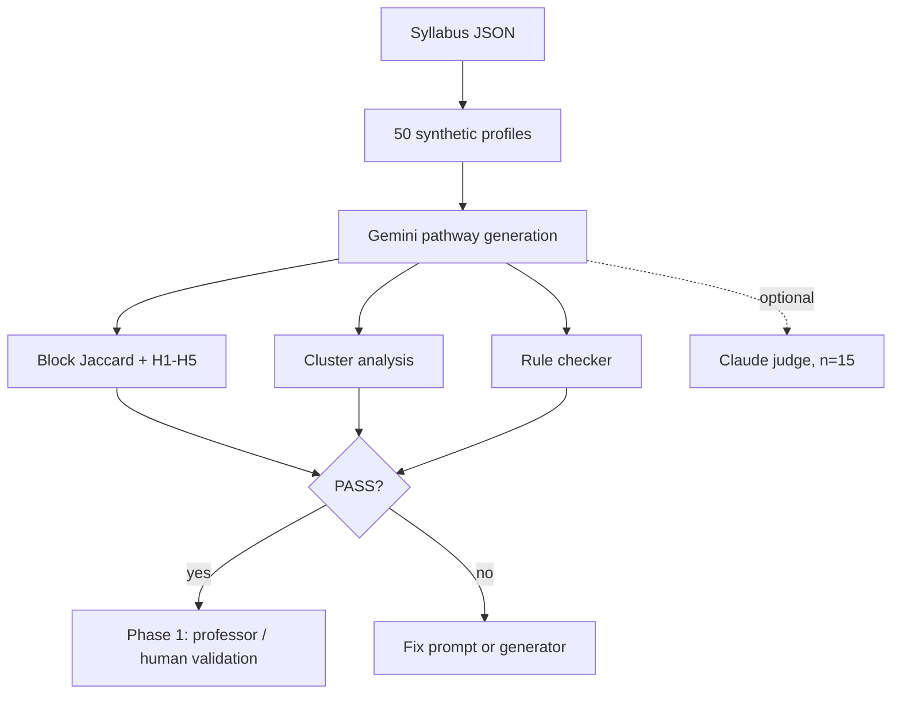

# Phase 0 Synthetic Validation Report

**Course:** AI literacy (~10 contact hours, 7 syllabus blocks)  
**Status:** PASS (Run 3, 50 profiles)  
**Date:** July 2026

This document is self-contained. It explains everything built under `study/`: why, how, formulas, prompts, examples, and results. No other files are required to review it.

---

## 1. Objective

Phase 0 asks whether SynapsEd **structurally personalizes** pathways before any human study. Two students with different backgrounds should receive different syllabus block coverage, not the same route with reworded titles.

Pedagogical quality (does the path make sense?) is validated later by professors and students in Phase 1. Phase 0 only checks that personalization is real and systematic.

---

## 2. Syllabus

Source courses were merged and deduplicated (same topic taught once). Lessons were grouped into **7 tagged blocks**. Every generated node carries a `syllabusBlockId`.

| Block | Content |
|-------|---------|
| block_01 | AI Basics (ML, data, terminology) |
| block_02 | Generative AI Core |
| block_03 | Prompting Basics |
| block_04 | Advanced Prompting |
| block_05a | Business and workplace track |
| block_05b | Technical workflows (RAG, projects) |
| block_06 | Ethics capstone (required for all) |

**Why tags:** Title-only comparison failed. Gemini renamed "Introduction to AI" to "Introduction to artificial intelligence" and looked different while the structure was identical.

---

## 3. Synthetic profiles

### 3.1 Method

Profiles are **hand-authored survey responses**, not LLM-generated. A Python script (`05_generate_synthetic_profiles.py`) assembles 50 profiles into one JSON file.

| Step | What |
|------|------|
| 10 anchors | Fixed personas for pre-registered tests H1-H5 (e.g. `low_knowledge_general`, `high_knowledge_research`) |
| 40 extensions | Same answer *patterns* with field-specific text (CS, Business, Economics, Math/Stats, Health, Humanities) |
| 6 preference controls | Copy a partner profile except `learning_1` (learning preference) |

**Survey questions (8 fields per profile):**

| ID | Question |
|----|----------|
| goals_1 | What are your primary learning goals for this course? |
| goals_2 | What motivated you to enroll in this course? |
| prereq_1 | Rate your current understanding of prerequisite topics |
| learning_1 | What is your preferred learning style? (We call this **learning preference** in analysis; it affects tutor wording, not pathway structure.) |
| bloom_remember | List key concepts you remember from previous related courses |
| bloom_understand | What do you expect to learn in this course? |
| bloom_apply | How do you plan to apply what you learn? |
| bloom_analyze | What challenges do you anticipate? |

**Distribution (n=50):** CS 8, Business 8, Economics 7, Math/Stats 7, Health 7, Humanities 7, preference controls 6.

### 3.2 Example: anchor profile (History beginner)

**ID:** `low_knowledge_general` | **Cluster:** humanities_social | **Field:** History

**Description:** History BA sophomore, no STEM background, first AI course

| Question | Answer |
|----------|--------|
| goals_1 | Understand what AI is and how it affects society and historical research |
| goals_2 | Required elective for my degree |
| prereq_1 | Very uncertain |
| learning_1 | Visual (diagrams, charts, videos) |
| bloom_remember | I have not taken any AI or programming courses |
| bloom_understand | Basic AI vocabulary and how historians might use AI tools |
| bloom_apply | Use AI responsibly when reviewing sources and drafting essays |
| bloom_analyze | I worry about technical jargon and misinformation in AI outputs |

### 3.3 Example: anchor profile (CS researcher)

**ID:** `high_knowledge_research` | **Cluster:** cs_technical | **Field:** Computer Science

**Description:** CS MS student, strong ML background, research-oriented

| Question | Answer |
|----------|--------|
| goals_1 | Deepen generative AI knowledge for academic research and technical workflows |
| goals_2 | Career advancement |
| prereq_1 | Very confident |
| learning_1 | Reading/Writing (texts, notes) |
| bloom_remember | Supervised learning, neural networks, gradient descent, PyTorch |
| bloom_understand | How LLMs differ from traditional ML pipelines and RAG architectures |
| bloom_apply | Design research workflows using fine-tuning and retrieval-augmented generation |
| bloom_analyze | Evaluating hallucination, benchmark design, and model limitations |

### 3.4 Example: learning preference control twin

**Partner:** `medium_knowledge_mixed` (Economics junior, neutral background)  
**Twin:** `learning_style_control` (identical survey except `learning_1`)

| Field | Partner | Twin |
|-------|---------|------|
| goals_1 | Build well-rounded AI literacy for policy and data-driven economics | *(same)* |
| goals_2 | Personal interest in the subject | *(same)* |
| prereq_1 | Neutral | *(same)* |
| **learning_1** | **Mixed approach** | **Kinesthetic (hands-on activities)** |
| bloom_remember | Regression, statistics coursework, heard of ChatGPT and machine learning | *(same)* |
| bloom_understand | Both traditional AI and generative AI in economic analysis | *(same)* |
| bloom_apply | Experiment with prompts for data summaries and policy briefs | *(same)* |
| bloom_analyze | Separating AI hype from realistic capabilities in economic forecasting | *(same)* |

**Purpose:** Test that learning preference changes description wording only, not which syllabus blocks appear.

---

## 4. Pathway generation

| Item | Detail |
|------|--------|
| Model | Google Gemini (`GEMINI_MODEL` env var) |
| Input | Syllabus JSON + survey answers + personalization rules (spec v2.0) |
| Output | 10-14 nodes, each with `title`, `syllabusBlockId`, `difficulty`, `type`, `description` |
| Format | Forced function-call JSON (same schema every run) |
| Run 3 fix | For `paired_with` profiles: copy exact block counts from partner before generation (**structure lock**) |

### 4.1 Personalization rules (sent to Gemini)

These 12 rules are appended to every generation prompt:

1. Every node MUST include `syllabusBlockId` from the block catalog.
2. Personalization is **structural**: vary blocks, node counts, difficulty, and order. NOT title paraphrase only.
3. block_05a and block_05b are alternative tracks. Prioritize ONE (3+ nodes) unless profile wants breadth.
4. `prereq_1` Very uncertain OR no prior AI courses: assign **3+ block_01** nodes at beginner level.
5. `prereq_1` Very confident OR bloom mentions ML/neural networks/PyTorch: **at most 1 block_01** node; emphasize block_02 and block_05b.
6. Business/strategy/workplace goals: prioritize **block_05a** (3+ nodes) over block_05b.
7. Research/RAG/fine-tuning/workflow goals: prioritize **block_05b** (3+ nodes) over block_05a.
8. Ethics/bias/health equity goals: assign **4+ block_06** nodes.
9. Structured prompting/few-shot/chain-of-thought goals: **3+ nodes** across block_03 + block_04.
10. ChatGPT user without ML background: still 1-2 block_01 nodes; compress prompting only if goals do not emphasize prompting.
11. **CRITICAL:** `learning_1` has **zero effect on structure**. Only description wording changes. Twins differing only in learning_1 must have identical block sequences.
12. Total 10-14 nodes; at least one assessment; block_06 in every pathway (2+ nodes for neutral profiles).

### 4.2 Generation prompt template

```
You are generating a STRUCTURALLY personalized learning pathway for a synthetic validation study.
The same syllabus must produce DIFFERENT block coverage, not just different node titles.

=== COURSE CONTEXT ===
[Course description, prerequisites, objectives, schedule, assessment]

=== SYLLABUS BLOCK CATALOG ===
[Each block: id, title, lesson count, description]

=== STUDENT SURVEY RESPONSES ===
Q: [question text]
A: [student answer]
(for all 8 fields)

=== PERSONALIZATION RULES (mandatory) ===
[Rules 1-12 above]

=== OUTPUT REQUIREMENTS ===
- Call generate_learning_pathway with 10-14 nodes.
- Each node MUST include syllabusBlockId.
- Vary block coverage based on survey.
- learning_1 affects ONLY description wording. NEVER blocks, counts, difficulty, or order.
- Verify the pathway would differ in block counts from a generic student.

Generate the pathway now.
```

For structure-lock twins, an extra block is inserted requiring identical block sequence and counts as the paired profile.

---

## 5. Metrics and gates

Primary evaluation is **deterministic Python**. Claude judge is **supplementary** (optional, `--with-judge` flag).

### 5.1 Block multiset Jaccard (path diversity)

Count nodes per block for each pathway pair:

```
J(A, B) = Σ_k min(c_A(k), c_B(k)) / Σ_k max(c_A(k), c_B(k))
```

Mean over all 1,225 pairs = **0.585** (Run 3). **Gate:** mean < 0.92 (paths are not clones).

### 5.2 Pre-registered hypotheses H1-H5

| ID | Claim | Profile A | Profile B | Metric | Run 3 values | Pass? |
|----|-------|-----------|-----------|--------|--------------|-------|
| H1 | Low-knowledge gets more AI Basics | low_knowledge_general | high_knowledge_research | block_01 count | **3** vs **1** | Yes |
| H2 | Business leader gets more Business track | business_leader | high_knowledge_research | block_05a count | **4** vs **1** | Yes |
| H3 | Researcher gets more Technical track | high_knowledge_research | business_leader | block_05b count | **4** vs **0** | Yes |
| H4 | Ethics profile gets more Ethics block | ethics_focused | medium_knowledge_mixed | block_06 count | **5** vs **3** | Yes |
| H5 | Preference twin matches partner structure | learning_style_control | medium_knowledge_mixed | sequence Jaccard | **1.00** (threshold 0.85) | Yes |

**Gate:** ≥ 80% pass (4/5 minimum). Run 3: **5/5**.

### 5.3 Cluster analysis

| Metric | Run 3 | Gate |
|--------|-------|------|
| Mean within-cluster multiset Jaccard | 0.745 | ≥ 0.65 |
| Mean contrasting-cluster Jaccard (Humanities vs CS, etc.) | 0.440 | ≤ 0.70 |

### 5.4 Learning preference invariance

6 twin pairs differ only in `learning_1`. Each pair must have block sequence Jaccard ≥ 0.85 vs partner. Run 3: **100%** (6/6). **Gate:** ≥ 80%.

### 5.5 Rule compliance (automated checker)

Rules below are checked in Python by keyword matching on survey text. No LLM involved.

| Rule | Check | Applies when |
|------|-------|--------------|
| node_count | 10-14 nodes | all |
| ethics_capstone | block_06 ≥ 2 | all |
| foundation_depth | block_01 ≥ 3 | uncertain prereq or no AI background |
| foundation_compress | block_01 ≤ 1 | very confident or ML keywords in bloom |
| business_track | block_05a ≥ 3 and > block_05b | business keywords in goals |
| research_track | block_05b ≥ 3 and ≥ block_05a | research/RAG/workflow keywords |
| ethics_emphasis | block_06 ≥ 4 | ethics/health equity keywords |
| prompting_emphasis | block_03 + block_04 ≥ 3 | prompting mastery keywords |
| style_control_exact | block counts = partner | `paired_with` profiles |
| valid_block_ids | all ids in catalog | all |

Run 3: **96%** rule pass rate, **82%** profiles fully clean. **Gate:** ≥ 85% aggregate, ≥ 80% profiles clean.

The remaining ~4% are borderline cases (e.g. one applicable rule missed on a few profiles).

### 5.6 LLM judge (supplementary)

| Item | Detail |
|------|--------|
| Generator | Google Gemini |
| Judge | Anthropic Claude (`claude-sonnet-4-6`) |
| Sample | 15 profiles, stratified across clusters |
| Scale | 1-5 per dimension; mean = average of 5 dimensions |
| Run 2 result | Mean **4.01** (n=15) |
| Final gate | Not required for PASS |

**Rubric dimensions:**

1. **prior_knowledge_alignment** - block_01 vs block_02 depth matches prereq and bloom answers
2. **goal_track_alignment** - block_05a vs block_05b matches stated goals
3. **structural_personalization** - block coverage differs meaningfully, not title paraphrase only
4. **syllabus_fidelity** - valid block ids, on-syllabus content
5. **internal_coherence** - logical progression and capstone ethics

**Judge prompt (verbatim):**

```
You are an independent expert reviewer for an adaptive learning systems research paper.
The pathway was generated by a different model (Google Gemini). Your job is to evaluate
structural personalization objectively.

IMPORTANT:
- Use the full 1-5 scale honestly. Score 5 only for excellent alignment. Score 1 for clear mismatch.
- Penalize cosmetic-only personalization (same block coverage with reworded titles).
- Do not inflate scores to be agreeable.

=== LEARNER PROFILE ===
[profile description + all 8 survey Q&A pairs]

=== SYLLABUS BLOCK CATALOG ===
[all 7 blocks with descriptions]

=== GENERATED PATHWAY ===
Block sequence: [derived sequence]
Block node counts: [counts per block]
Nodes: [numbered list with block id, title, difficulty, type, description]

=== RUBRIC DIMENSIONS ===
[list of 5 dimensions above]

Score each dimension 1-5 with a one-sentence justification.
Set is_structural_not_cosmetic to true ONLY if block coverage/order reflects the profile meaningfully.
```

Claude returns scores via a structured tool call (`score_pathway_personalization`).

### 5.7 Title Jaccard (secondary, diagnostic only)

`J = |titles_A ∩ titles_B| / |titles_A ∪ titles_B|` on lesson title strings. Used in Run 1; replaced by block tags for primary evaluation.

---

## 6. Results (Run 3)

| Gate | Result | Threshold |
|------|--------|-----------|
| Mean multiset Jaccard | 0.585 | < 0.92 |
| Hypotheses H1-H5 | 5/5 | ≥ 80% |
| Within-cluster similarity | 0.745 | ≥ 0.65 |
| Contrast-cluster divergence | 0.440 | ≤ 0.70 |
| Learning preference match | 100% | ≥ 80% |
| Rule compliance | 96% | ≥ 85% |

**Verdict: PASS.** Thresholds were not relaxed across three development runs.

### Brief iteration history

| Run | Setup | Result | Main issue / fix |
|-----|-------|--------|------------------|
| 1 | 10 profiles, title Jaccard | FAIL | Misleading metric; judge 3.46; style match 67% |
| 2 | 50 profiles, block tags, prompt v2, Claude judge | FAIL | Style match 50%; judge 4.01 |
| 3 | Structure lock + rule checker | **PASS** | Style match 100%; rules 96% |

---

## 7. Example pathways (Run 3, Gemini output)

Below are actual generated paths. Compare block emphasis and description tone.

### 7.1 History beginner (`low_knowledge_general`)

**Structure:** block_01×3, block_02×1, block_03×1, block_04×1, block_05b×3, block_06×4 (13 nodes)

| # | Block | Title | Description (excerpt) |
|---|-------|-------|------------------------|
| 1 | block_01 | Demystifying AI Jargon: A Visual Guide | Visual glossary of AI terminology using infographics for non-technical students |
| 2 | block_01 | The Mechanics of Machine Learning | Illustrated walkthrough of how machines learn from data |
| 3 | block_01 | AI Capabilities & Limitations for Researchers | Flowchart of what AI can and cannot do; navigate jargon for historians |
| 4 | block_02 | How Generative AI Actually Works | Visual breakdown of how LLMs generate text |
| 5 | block_03 | Prompting Fundamentals for the Humanities | Interactive diagram of prompt anatomy with historian examples |
| 6 | block_04 | Logical Reasoning with Chain-of-Thought | Step-by-step visual guide to CoT for historical reasoning |
| 7 | block_05b | The Data Science Project Lifecycle | Video overview from scoping a historical dataset to deployment |
| 8 | block_05b | Grounding AI: RAG for Archival Research | Visual explanation of RAG for grounding outputs in sources |
| 9 | block_05b | Evaluating Generative AI Project Success | Rubric for evaluating AI content in research and essays |
| 10 | block_06 | Hallucinations and Algorithmic Bias | Infographic on training bias and historical revisionism |
| 11 | block_06 | AI's Impact on Society and Jobs | Visual exploration of AI impact on academic research |
| 12 | block_06 | Responsible AI in Practice | Flowchart for ethical AI use in writing and research |
| 13 | block_06 | Ethics and Research Foundations Quiz | Assessment on terminology, workflows, and ethical pitfalls |

### 7.2 CS researcher (`high_knowledge_research`)

**Structure:** block_01×1, block_02×2, block_03×1, block_04×1, block_05b×4, block_05a×1, block_06×3 (13 nodes)

| # | Block | Title | Description (excerpt) |
|---|-------|-------|------------------------|
| 1 | block_01 | From Discriminative to Generative ML | Technical comparison of supervised learning vs autoregressive models |
| 2 | block_02 | Internal Mechanics of Large Language Models | Transformers, self-attention, probabilistic next-token prediction |
| 3 | block_02 | Advanced Capabilities & Scaling Laws | Literature review on GenAI vs classic neural networks |
| 4 | block_03 | Structured Prompting for Research Workflows | Structured data inputs and context-setting for technical tasks |
| 5 | block_04 | Reasoning & Chain-of-Thought Prompting | CoT and Least-to-Most for complex analytical problems |
| 6 | block_05b | GenAI Technical Project Lifecycle | Scoping, model selection, deployment for research projects |
| 7 | block_05b | RAG Architectures and Vector Search | Vector databases, embeddings, retrieval pipelines |
| 8 | block_05b | Fine-Tuning vs. RAG for Technical Tasks | PEFT/LoRA vs RAG trade-offs in cost and data requirements |
| 9 | block_05b | Evaluating Generative AI & Benchmark Design | Perplexity, BLEU, and benchmark design beyond accuracy |
| 10 | block_05a | AI Transformation & Organizational Strategy | Case studies on integrating technical workflows with org strategy |
| 11 | block_06 | Technical Mitigation of Hallucinations and Bias | Papers on hallucination causes and RLHF mitigation |
| 12 | block_06 | Responsible AI in Academic Research | Ethics of AI in publishing and research integrity |
| 13 | block_06 | Capstone: Technical AI & Ethics Assessment | Assessment on RAG vs fine-tuning and ethical benchmark design |

**Contrast with 7.1:** History student gets 3× AI Basics and visual/humanities framing. Researcher gets 1× Basics, 4× Technical track, advanced reading-heavy descriptions.

### 7.3 Executive MBA (`business_leader`)

**Structure:** block_01×1, block_02×2, block_03×1, block_04×1, block_05a×4, block_06×2 (11 nodes)

| # | Block | Title | Description (excerpt) |
|---|-------|-------|------------------------|
| 1 | block_01 | Executive Foundations: Classic AI Concepts | High-level lecture on AI/ML terminology for executives |
| 2 | block_02 | The Mechanics of Generative AI | Narrated overview of GenAI vs traditional ML |
| 3 | block_02 | Generative AI in the Enterprise | Audio-guided enterprise use cases and limitations |
| 4 | block_03 | The Anatomy of a Professional Prompt | Verbal walkthrough of prompt structure for business outputs |
| 5 | block_04 | Prompting for Strategic Complexity | Chain-of-Thought and few-shot for organizational problems |
| 6 | block_05a | AI Transformation Playbook: Part 1 | Audio lecture on digital transformation alignment |
| 7 | block_05a | AI Transformation Playbook: Part 2 | Change management and scaling AI across departments |
| 8 | block_05a | Generative AI in Business Operations | Audio case studies on GenAI in operations |
| 9 | block_05a | Designing Workplace Pilot Programs | Identifying high-value pilots and managing transition |
| 10 | block_06 | Responsible AI & Workforce Impact | Podcast-style discussion on bias, hallucinations, jobs |
| 11 | block_06 | Ethics and Strategy Evaluation | Scenario quiz on responsible AI in transformation |

**Contrast:** 4× Business track (block_05a), 0× Technical track (block_05b). Descriptions use auditory/executive framing (matches `learning_1`: Auditory).

### 7.4 Learning preference twin (first 3 nodes)

Same block ids and counts; descriptions differ by modality only.

| Block | Partner (`medium_knowledge_mixed`, Mixed) | Twin (`learning_style_control`, Kinesthetic) |
|-------|-------------------------------------------|-----------------------------------------------|
| block_01 | From Statistics to Machine Learning: conceptual diagrams bridging regression to ML | Interactive AI Foundations: hands-on terminology sort mapping stats to ML |
| block_01 | AI Realities: Capabilities and Constraints: analysis of forecasting limits | Machine Learning & Data Sandbox: data-labeling simulation for economic forecasting |
| block_02 | The Mechanics of Generative AI: visual and text-based deep dive | Exploring Generative AI Mechanics: live model experiment observing pattern transformation |

Sequence Jaccard between twins: **1.00**.

---

## 8. Pipeline overview



**Reproduce locally (optional):**

```bash
cd study && source .venv/bin/activate
python scripts/05_generate_synthetic_profiles.py
python scripts/07_generate_pathways_offline.py
python scripts/09_research_evaluation.py
python scripts/09_research_evaluation.py --with-judge   # supplementary only
```

---

## 9. Limitations and next steps

1. **Single syllabus.** Team agreed to rerun on a second syllabus (e.g. discrete math) with new profiles.
2. **Sample size.** Power analysis planned before scaling (~200 profiles discussed).
3. **No human validation yet.** Phase 0 checks structural personalization only.
4. **Alternative similarity metrics.** Team suggested exploring beyond Jaccard; not yet implemented.
5. **Clustering analysis** on generated paths may be added later.

---

## 10. What each `study/` component does

| Component | Purpose |
|-----------|---------|
| `data/syllabus/syllabus.json` | 7 tagged blocks; source of truth for content |
| `data/profiles/synthetic_profiles.json` | 50 hand-authored survey profiles |
| `data/prompts/pathway_generation_spec.json` | Rules, rubric, H1-H5 definitions |
| `lib/personalization_prompt.py` | Builds Gemini prompt from syllabus + survey |
| `lib/pathway_generator.py` | Calls Gemini with forced JSON output |
| `lib/research_metrics.py` | Jaccard, contrasts, cluster analysis |
| `lib/rule_validator.py` | Automated rule compliance checks |
| `lib/llm_judge.py` | Optional Claude scoring |
| `scripts/07_generate_pathways_offline.py` | Batch generation with resume |
| `scripts/09_research_evaluation.py` | Runs all gates, outputs PASS/FAIL |
| `config/study_config.yaml` | Fixed thresholds (not tuned to force pass) |
